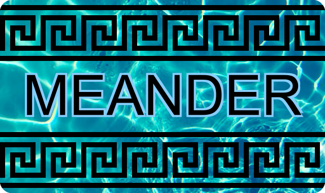

<h1 align="center" style="display: block; font-size: 2.5em; font-weight: bold; margin-block-start: 1em; margin-block-end: 1em;">
  
</h1>

Meander is a .net library allowing you to produce images by performing modifications to existing images, or to images generated from scratch.

The Meander library depends on the following libraries:

 - [SixLabors.ImageSharp](https://github.com/SixLabors/ImageSharp)
 - [SixLabors.ImageSharp.Drawing](https://github.com/SixLabors/ImageSharp.Drawing)

# Principles

You start by defining an _image processor_, working on either an existing image file on disk, an image in memory, or an empty image with specified dimensions. No processing is done in this step, this just starts the chain of operations that will eventually be performed. You then add more operations that will be performed on the image. Finally, you call the Get() function to generate and return the resulting image.

# Why "Meander"?

A river that [meanders](https://en.wikipedia.org/wiki/Meander) through a region will in time modify it, just like our library will modify images. The name also reflects the [fluent principles](https://en.wikipedia.org/wiki/Fluent_interface) that guide the Meander library.

# Getting started

A "hello, world" application, starting from scratch, setting the background color to yellow and adding the text "Hello, world" in the center of the image: 

````c#
    ImageProcessor
        .StartFromScratch(320, 200)
        .WithSolidRectangle(0, 0, 320, 200, Color.Yellow)
        .WithText("Hello, World", 160, 100, Color.Blue, "Arial", 32, HorizontalAlignment.Center, VerticalAlignment.Center)
        .Get();
````

This code returns an [image](https://docs.sixlabors.com/api/ImageSharp/SixLabors.ImageSharp.Image.html), which can e.g. be saved to disk using its Save() function.

# Basic operations

Among the basic operations are operations that allow you to crop, resize, generate simple geometric figures, inserting images, etc. These are all implemented as special cases of a general "mutate" operation, which performs mutations on the underlying ImageSharp objects. You may also use the "mutate" operation to perform mutations that do not have any implementation in the Meander library.

Below is code for some of the basic operations. Samples can be found in the [BasicOperations](https://github.com/skanejohan/Meander/tree/master/Samples/BasicOperations) project.

## Rectangle operations

````c#
    ImageProcessor
        .StartFromScratch(100, 100)
        .WithSolidRectangle(0, 0, 100, 100, Color.Green)
        .WithoutSolidRectangle(30, 30, 40, 40)
        .Get();
````
<image src="Doc/Rectangle.png">

## Combination of rectangle and ellipse effects

````c#
    ImageProcessor
        .StartFromScratch(100, 100)
        .WithSolidRectangle(0, 0, 100, 100, Color.Green)
        .WithoutInvertedEllipse(50, 50, 40, 30)
        .WithInvertedEllipse(50, 50, 30, 40, Color.BurlyWood)
        .Get();
````
<image src="Doc/WithoutInvertedEllipseWithInvertedEllipse.png">

## A cropped circle

````c#
    ImageProcessor
        .StartFromScratch(100, 100)
        .WithCircle(50, 50, 40, Color.RebeccaPurple)
        .CroppedTo(10, 10, 50, 50)
        .Get();
````
<image src="Doc/CroppedCircle.png">

## Re-using a previously created image

````c#
    var image = ImageProcessor
        .StartFromScratch(100, 100)
        .WithCircle(50, 50, 30, Color.Green)
        .Get();
    ImageProcessor
        .StartFromScratch(100, 100)
        .WithCircle(50, 50, 40, Color.Red)
        .WithImage(image, -20, -20, 0.5f)
        .WithImage(image, 20, 20)
        .Get();
````
<image src="Doc/Image.png">

## Rounded corners

````c#
    ImageProcessor
        .StartFromScratch(100, 100)
        .WithSolidRectangle(0, 0, 100, 100, Color.Green)
        .WithRoundedCorners(20)
        .Get();
````
<image src="Doc/RoundedCorners.png">

## Text

````c#
    ImageProcessor
        .StartFromScratch(600, 400)
        .WithSolidRectangle(0, 0, 600, 400, Color.Green)
        .WithText("HEADER", 300, 40, Color.Black, fontName: "Courier New", fontSize: 40, horizontalAlignment: SixLabors.Fonts.HorizontalAlignment.Center)
        .WithText(
            "Lorem ipsum dolor sit amet, consectetur adipiscing elit, sed do eiusmod tempor incididunt ut labore et dolore magna aliqua. " +
            "Ut enim ad minim veniam, quis nostrud exercitation ullamco laboris nisi ut aliquip ex ea commodo consequat. Duis aute irure " +
            "dolor in reprehenderit in voluptate velit esse cillum dolore eu fugiat nulla pariatur.", 10, 80, Color.White,
            fontSize: 16, wrappingLength: 200)
        .Get();
````
<image src="Doc/Text.png">

# Edge detection

````c#
    ImageProcessor
        .StartFromSourceFile("img_woman.jpg")
        .GetEdges()
````
<image src="Doc/Woman.png">

Samples can be found in the [EdgeDetection](https://github.com/skanejohan/Meander/tree/master/Samples/EdgeDetection) project.

# Pixel effects

````c#
    ImageProcessor
        .StartFromSourceFile("img_london.jpg")
        .CroppedTo(220, 245, 30, 45)
        .GetExpandedToPixelSize(8);
````
<image src="Doc/london.png">

Samples can be found in the [PixelEffects](https://github.com/skanejohan/Meander/tree/master/Samples/PixelEffects) project.

# Cartoon effects

````c#
    ImageProcessor
        .StartFromSourceFile("img_house.jpg")
        .GetCartoonified(KnownEdgeDetectorKernels.Prewitt, 1, 1);
````
<image src="Doc/House.png">

Samples can be found in the [CartoonEffects](https://github.com/skanejohan/Meander/tree/master/Samples/CartoonEffects) project.

# Additional samples

The [GenerateLogo](https://github.com/skanejohan/Meander/tree/master/Samples/GenerateLogo) contains code for generating the Meander logo.
